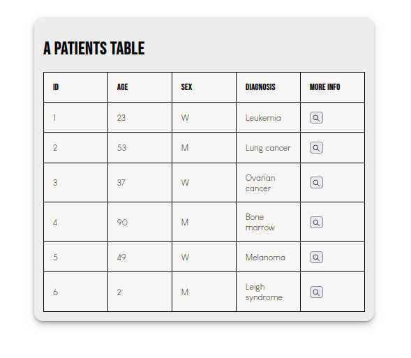

# A patients table

A simple exercise to render a patients' list data into a table with different columns, including a button to see more information.

### Clone this repository

Open the directory where you want to download this project with your terminal and type:
`git clone git@github.com:MayuRuru/patients-table.git`

**`npm install`**

It will download necessary dependencies and libraries, such as:

- Json-server
- React suite

**`npm start`**

Open [http://localhost:3000](http://localhost:3000) to view it in your browser.

**`npm run mock_api`**

Open [http://localhost:8000/patients](http://localhost:8000/patients), and display the Network responses in the browser inspector to see the mocked API response. With json-server, you could add new data to db.json file and it would watch how the API changes.

## Improvements

If I would have invested more time, I would have liked to perform some tests and to pass extra data to the button to display when clicked.
